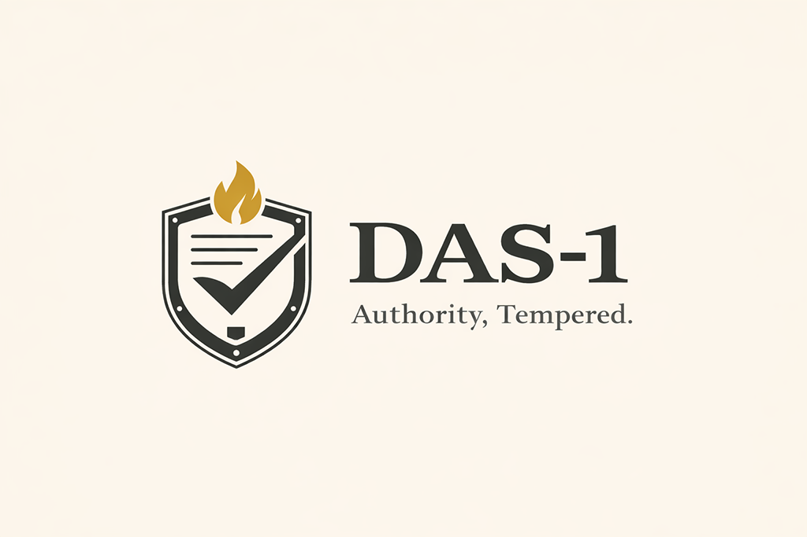

<p align="center">
  
</p>

<p align="center"><strong>Authority, Tempered.</strong></p>
# DAS-1(TM): Delegated Authority Standard(TM)

Tool calls are production changes.

AI is moving from content generation to execution. Agentic workflows and AI-powered automations now invoke tools: they change state, touch sensitive data, trigger workflows, and spend money at machine speed while approvals still happen at human speed.

That gap becomes your next incident.

DAS-1(TM) is a minimal, operator-grade standard for delegated authority in AI and agentic systems. It defines 12 Authority Engineering Controls (AEC-01 through AEC-12), required drills, and conformance claims backed by receipts.

- Core Spec: spec/core/das-1-core.md
- Conformance: spec/conformance/
- Controls Catalog: catalog/
- Profiles: profiles/
- Overlays: overlays/

Current overlay bundles:
- `openclaw`: gateway exposure, prompt-injection boundary, sandbox/session isolation, revocation readiness.
- `claude-code`: supervised coding-agent controls (propose/execute boundary, workspace containment, shell/git gating, MCP boundaries, CI execute boundary, approval integrity, revocation readiness).

## What this is for

Use DAS-1 when an AI agent, automation, or workflow can:
- Invoke tools (APIs, connectors, scripts, pipelines)
- Read sensitive data
- Write changes to systems of record
- Trigger actions with external side effects
- Incur material cost

## Core rules

- The core is closed at 12 controls. Extensions live in profiles, overlays, and the catalog.
- R3 and R4 actions require human approval before execution.
- Bypassing approval without disclosure is a conformance failure.
- If you cannot revoke it, you do not control it.
- Controls are risk-proportional: low-risk work should remain useful while high-risk work stays bounded.

## Conformance

You may claim "DAS-1(TM) v0.001 Conformant(TM)" only if:
- All 12 AEC controls are implemented, or explicitly excepted with expiry dates
- Both required drills executed within the last 90 days
- Minimum metrics M1-M7 are measurable from stored receipts

See: spec/conformance/conformance-criteria.md

Overlay claims are additive:
- Core claim: DAS-1(TM) v0.001 Conformant(TM)
- Overlay claim: DAS-1(TM) v0.001 Conformant(TM) + `<overlay>`

## Safety With Utility

DAS-1 is designed to protect delegated authority systems without making them inert.
- R1/R2 paths should be largely autonomous under policy.
- R3/R4 paths require explicit human gating.
- Utility guardrails (M5-M7) are part of conformance evidence.
- If emergency hardening materially reduces utility, it must be tracked as an expiring AEC-11 exception.

## Conformance Tooling Quickstart

Install tooling dependencies:

```bash
python -m pip install -r tools/requirements.txt
```

Verify core evidence:

```bash
python tools/das1_verify.py verify \
  --receipts das1/examples/receipt_packs \
  --exceptions das1/examples/exceptions \
  --drills das1/examples/drills \
  --tool-catalogs das1/examples/tool_catalogs \
  --policy-snapshots das1/examples/policy_snapshots \
  --ir-annexes das1/examples/ir_annexes \
  --report conformance-report.json
```

Verify core plus OpenClaw overlay:

```bash
python tools/das1_verify.py verify-overlay \
  --receipts das1/examples/openclaw/receipt_packs \
  --exceptions das1/examples/exceptions \
  --drills das1/examples/openclaw/drills \
  --tool-catalogs das1/examples/tool_catalogs \
  --policy-snapshots das1/examples/policy_snapshots \
  --ir-annexes das1/examples/ir_annexes \
  --overlay openclaw \
  --report openclaw-overlay-report.json
```

Verify core plus Claude Code overlay:

```bash
python tools/das1_verify.py verify-overlay \
  --receipts das1/examples/claude-code/receipt_packs \
  --exceptions das1/examples/exceptions \
  --drills das1/examples/claude-code/drills \
  --tool-catalogs das1/examples/tool_catalogs \
  --policy-snapshots das1/examples/policy_snapshots \
  --ir-annexes das1/examples/ir_annexes \
  --overlay claude-code \
  --report claude-code-overlay-report.json
```

Verify publishable claim packets:

```bash
python tools/das1_verify.py verify-claims das1/examples/claims
# optional: add --report claims-report.json for publishable evidence bundle output
```

See `/spec/conformance/README.md` for full command options and current machine checks.

## Overlay Extensions

The default verifier is runtime-agnostic and extensible:
- Overlay plugins live in `tools/overlays/`.
- Plugin contract is documented in `tools/overlays/README.md`.
- Overlay-specific evidence can be carried in namespaced `overlay_context` fields.

## Collaboration

Bring receipts.
- Run the checklist against one real agentic workflow and open an issue with artifacts and gaps.
- Propose a profile mapping (MCP, agentic UI, CI agent, ticketing agent) to the AEC controls.
- Propose an overlay manifest for regulated environments using the overlay pattern.

## Licensing

- Spec and documentation: CC BY 4.0 (see LICENSE-DOCS)
- Code and tooling: Apache 2.0 (see LICENSE and LICENSE-CODE)
- Brand assets (logos, marks, badges): all rights reserved, trademark governed (see assets/brand/LICENSE-ASSETS.txt and TRADEMARKS.md)

Status
- Version: v0.001 (draft)
- Date: 2026-02-12
